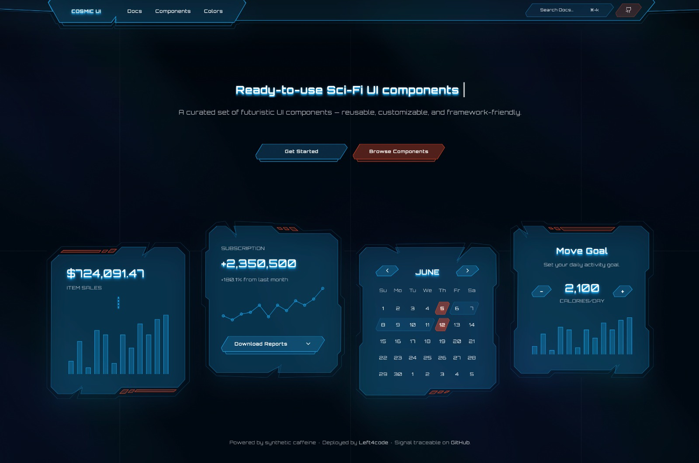

# Cosmic UI



Sci-fi themed React component library and docs site, ported from the original
Vite + React SPA to Astro (static output, React islands for interactive
parts).

## Dev

```bash
npm install
npm run dev
```

## Build

```bash
npm run build
npm run preview
```

## Structure

- `src/components/ui/` — the component library itself (Button, Dialog, Menu,
  Combobox, Toast, Tabs, Accordion, Alert, Checkbox, RadioGroup, Switch,
  Input, Textarea, Chart, Frame). Mostly thin wrappers around `@zag-js/*`
  state machines plus the custom `Frame` SVG decoration system.
- `src/components/docs/` — shared doc-page building blocks (`Wrapper`,
  `Title`, `Preview` tabs, `PreviewCode`, `InstallPackage`, TOC `Menu`).
- `src/components/pages/` — one file per route's actual content (near-1:1
  port of the old page's content), mounted as a React island.
- `src/components/SiteChrome.tsx` — header nav + mobile sidebar drawer,
  global across every page via `BaseLayout.astro`.
- `src/layouts/BaseLayout.astro` / `DocsLayout.astro` — page shells.
- `src/pages/` — thin Astro route files, one per `/docs/<name>` page plus
  `index.astro` (home).

## Adding a new component

1. Add the component to `src/components/ui/<name>.tsx` (`@zag-js/*` + `Frame` +
   `cva`/`twMerge`, matching the existing components' style).
2. Add its doc content to `src/components/pages/<name>.tsx` (copy an existing
   one as a template — `Preview`/`Installation`/`Usage` sections).
3. Add the route: `src/pages/docs/<name>.astro`, rendering
   `<DocsLayout><YourPage client:load /></DocsLayout>`.
4. Add a nav link in `src/components/SiteChrome.tsx`'s `docLinks`.
